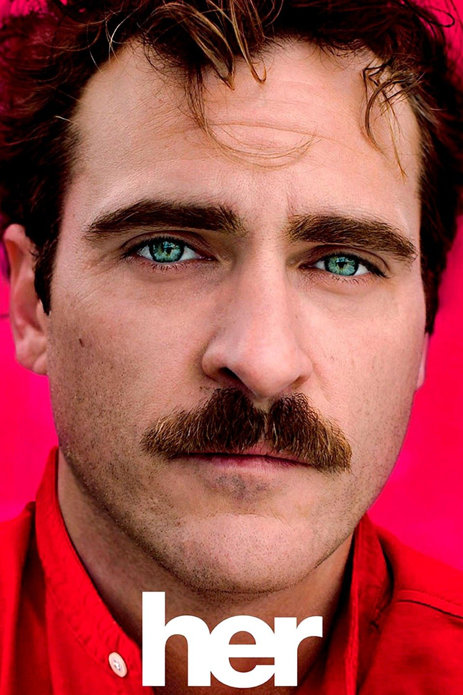

  

      <ul class="nav">
          <li><a href="{{ BASE_PATH }}/assets/broman_cv.pdf">Refresh</a></li>
          <li><a href="https://github.com/bsharvey">Survey</a></li>
      </ul>
  

### Movies You May Like

<table class="wide">
<tr>
  <td class="left">
    
  </td>

  <td class="right">
    
  </td>
</tr>
<tr>
  <td class="left">
    
  </td>
  <td class="right">
    
  </td>
</tr>
</table>

  

      <ul class="nav">
          <li><a href="index.html">back</a></li>
      </ul>
  

